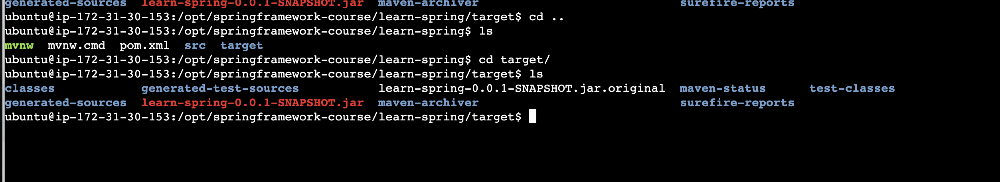

# Steps to start the project: 
   # Step:1  
   # 1)  git  clone the code ( https://github.com/bsmahi/springframework-course.git ) in the local machine/server.
  #  2) Go to the Project folder which has Source_code 
		            source_code: learning Spring
   # 3) Install java 
		Java 17 Version for the above project
		Check version : Java -version 
   # 4) Install Maven: 
		 apt/yum install maven 
	   Run:  mvn clean package  ( this life cycle goal will delete the previous package and create new package (Jar) )
			
	 3.1) The Maven  will create Target folder
	 3.2 ) Target Folder will have .jar file

						
